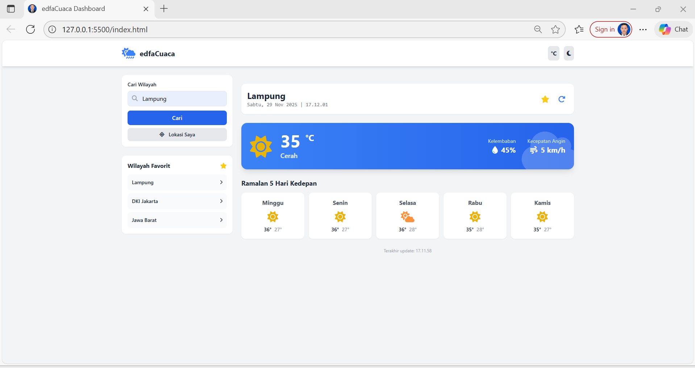
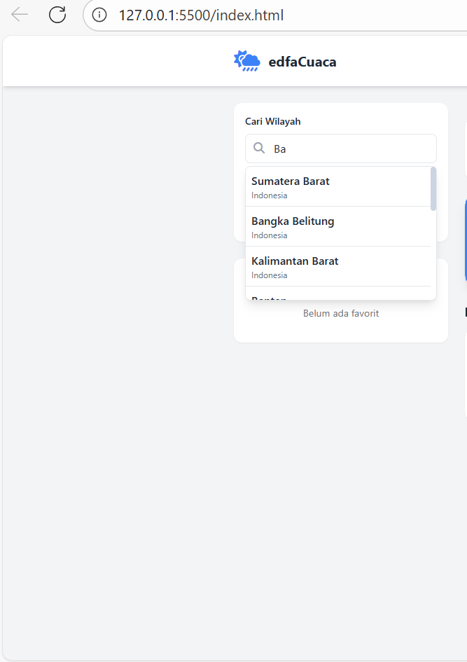
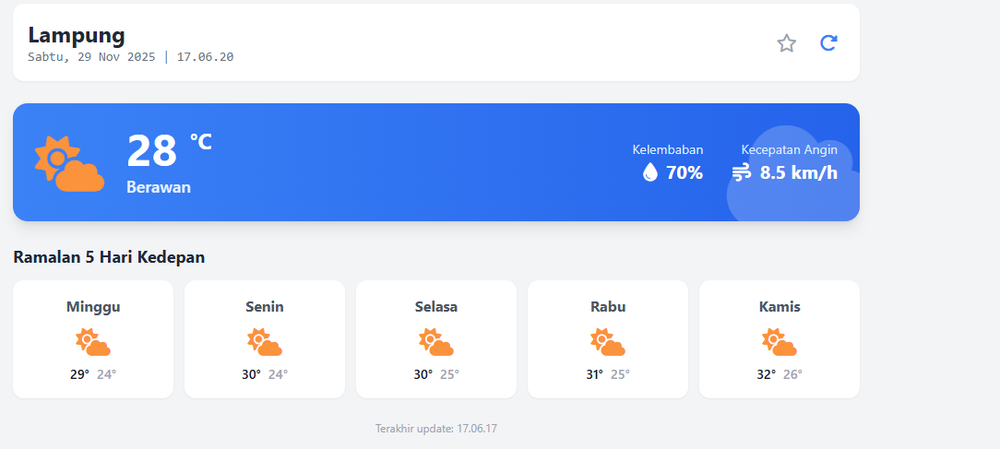
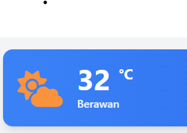
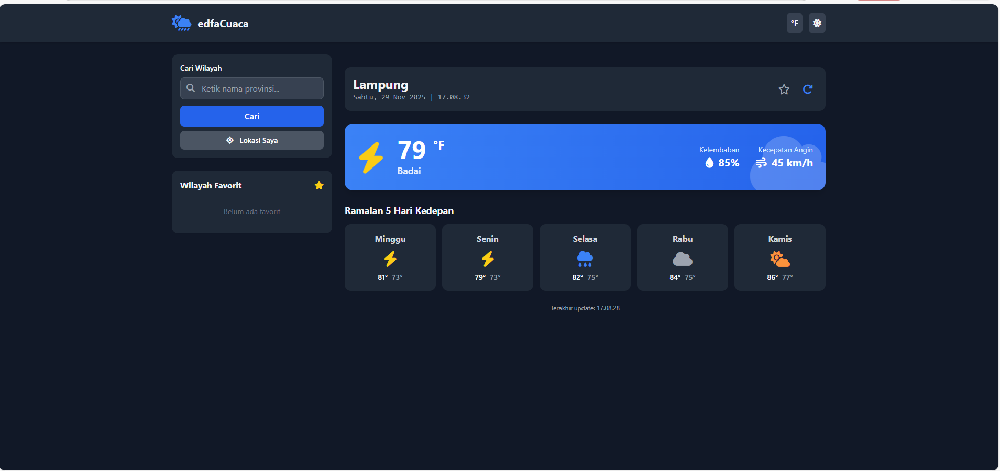
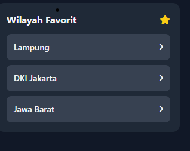

# edfaCuaca

edfaCuaca adalah aplikasi dashboard cuaca interaktif berbasis web yang dikembangkan sebagai pemenuhan **Tugas Akhir Judul 6 (AJAX & Web Service)**.  
Aplikasi ini mensimulasikan pemanggilan data cuaca secara **asinkron (AJAX)** dan menampilkannya melalui antarmuka yang modern, responsif, dan mudah digunakan.

---

## DASHBOARD

## 🚀 Fitur Utama

### 1. Pencarian Wilayah Cerdas  
Mendukung pencarian **38 Provinsi di Indonesia** dengan fitur autocomplete dan filter otomatis.

**Screenshot:**  

---

### 2. Data Cuaca Dinamis  
Menampilkan informasi:
- Suhu  
- Kelembaban  
- Kecepatan angin  
- Ikon cuaca  
- Ramalan 5 hari ke depan  

**Screenshot:**  

---

### 3. Simulasi Data Real-time  
Menggunakan 5 skenario cuaca JSON (cerah, hujan, badai, dll) yang dipilih secara acak.

**Screenshot:**  

---

### 4. Jam Digital & Auto-Refresh  
- Jam berjalan real-time  
- Data cuaca otomatis refresh setiap 5 menit  

**Screenshot:**  
``

---

## 🎨 Personalisasi Tampilan

### 1. Dark Mode  
Pengguna dapat beralih antara mode terang dan gelap.

**Screenshot:**  

---

### 2. Konversi Satuan Suhu  
Toggle antara Celsius (°C) dan Fahrenheit (°F).

**Screenshot:**  

---

### 3. Sistem Favorit  
Menyimpan lokasi favorit menggunakan LocalStorage agar tidak hilang ketika browser ditutup.

**Screenshot:**  

---

## 📦 Cara Menjalankan Aplikasi

Karena aplikasi menggunakan **fetch()** untuk mengambil file JSON lokal, browser akan memblokir akses jika langsung dibuka (due to CORS). Gunakan local server.

---

### 🔹 Opsi 1: Live Server di VS Code

1. Buka folder proyek di Visual Studio Code  
2. Install ekstensi **Live Server**  
3. Klik kanan `index.html` → **Open with Live Server**

---

### 🔹 Opsi 2: XAMPP / Laragon

1. Pindahkan folder proyek ke:
   - `htdocs` (XAMPP)  
   - `www` (Laragon)
2. Buka browser:  
   **http://localhost/edfaCuaca**

---

## 📘 Catatan Penggunaan Data

Aplikasi **tidak melakukan request ke internet**.  
Semua data cuaca berasal dari:

/data/cuaca.json

Berisi 5 skenario cuaca yang dipilih secara acak setiap kali pengguna memilih provinsi.

---

## ✍️ Penulis

**M. Azmi Edfa Alhafizh**  
Tugas Akhir Praktikum Pemrograman Web – Judul  6 (AJAX & Web Service)

---

